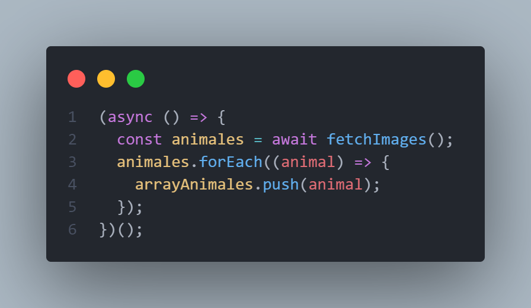
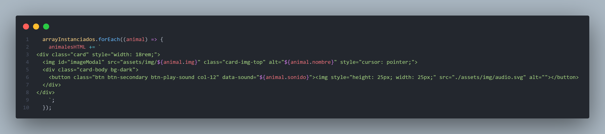
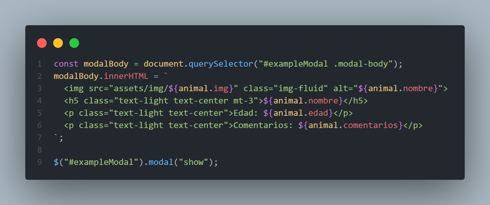
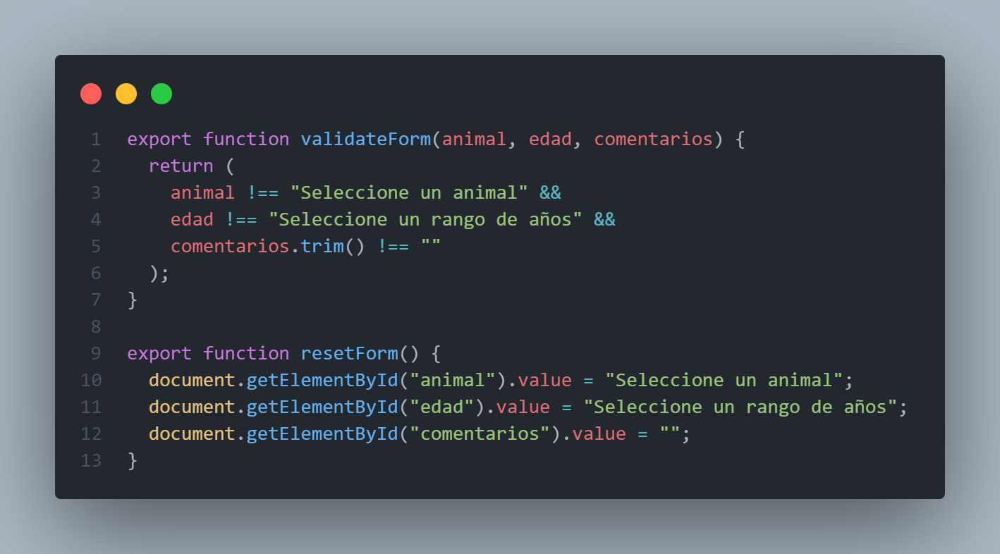
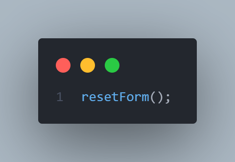
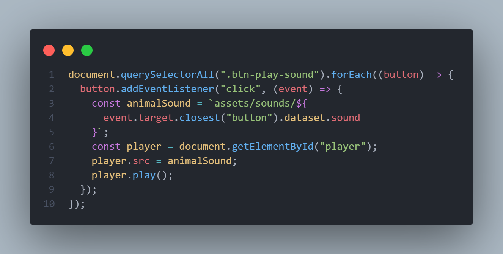
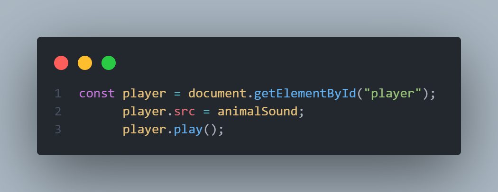
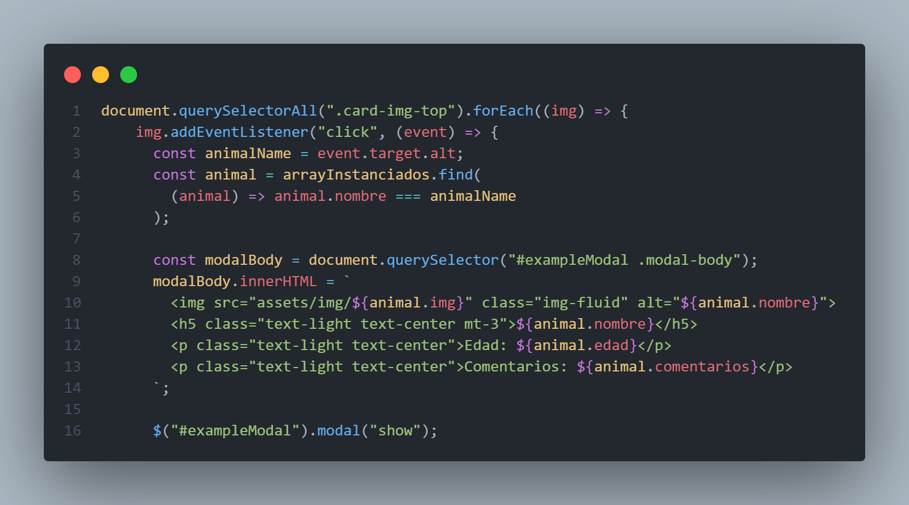

# Prueba programación avanzada en JavaScript 

### Por Nicolás Valderrama

`Esta prueba tiene los siguientes pasos para ser realizada`

-------------------------------------------------------------

1.- Se crean clases solicitadas, con una clase padre `Animal` y 5 clases hijo `León / Lobo / Oso / Serpiente / Aguila`.

2.- Se instancias las clases del formulario `{
    "Leon": Leon,
    "Lobo": Lobo,
    "Oso": Oso,
    "Serpiente": Serpiente,
    "Aguila": Aguila
  };`.

3.- Se realiza una consulta asíncrona utilizando una función async/await para obtener las imágenes correspondientes en el archivo `fetchImages`.

4.- Se realiza la función IIFE siguiente.

5.- Se divide el código en módulos `clases.js / fetchImages.js / formValidator.js / index.js` con sus export e import correspondientes.

6.- Se manipula por medio de Js el DOM para mostrar las 'cards' correspondientes a los animales y el 'modal'.

7.- Se validan los datos para agregar a la tabla de animales y que se encuentren ingresados todos estos, con el siguiente código.

8.- Se devuelve el formulario al estado inicial en la linea => '50'.

9.- Se programa la interacción del botón para esuchar el audio de cada animal.

Y además se programa el sonido para que se reproduzca al abrir la imagen y modal. 

en concreto `player.src = animalSound;
player.play();`

10.- Al hacer click en la imágen de la 'card' se abre el 'modal' con este siguiente evento.

`document.querySelectorAll(".card-img-top").forEach((img) => {
    img.addEventListener("click", (event) => {
    });
});` (Agrega un evento 'click' a la imágen)

`$("#exampleModal").modal("show");` (Abre el modal)